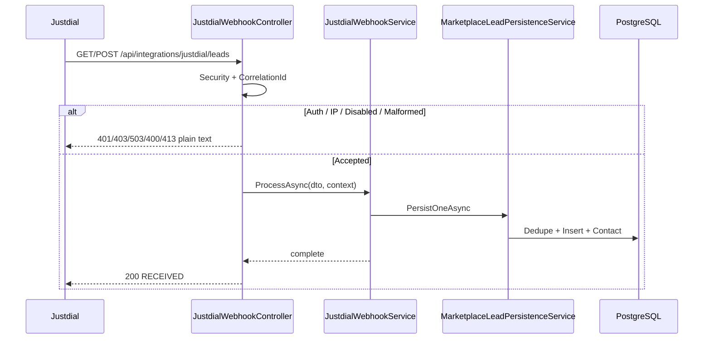

# Justdial Webhook – Phase 3 Production Guide

## Architecture

```
Justdial
  → JustdialWebhookController   (auth, correlation, size limits, RECEIVED contract)
  → JustdialWebhookService      (validate, map, metrics, per-leadid lock)
  → MarketplaceLeadMapper
  → MarketplaceLeadPersistenceService
  → Round Robin / Contact Sync / ActivityCapture / SaveChanges
  → HTTP 200 plain text RECEIVED
```

Future marketplace push integrations should add a mapper and call `IMarketplaceLeadPersistenceService` the same way.

## Execution flow

1. Resolve / generate `X-Correlation-Id`.
2. Evaluate security (`Enabled`, API key, IP whitelist, body size).
3. Deserialize GET query / JSON / form body.
4. Validate `leadid`, `name`, `mobile`.
5. Map to `LeadSyncIncomingLead` with Notes = `[crm-ext:Justdial:{leadid}]` only.
6. Acquire process-local lock for `leadid`.
7. Persist via shared marketplace service (`LeadSource = Justdial`).
8. Record metrics + structured logs.
9. Return `RECEIVED` (or non-RECEIVED only for auth / disabled / oversized / malformed).

## Sequence diagram



## Component responsibilities

| Component | Responsibility |
|-----------|----------------|
| `JustdialWebhookController` | Transport, security gate, correlation header, response contract |
| `JustdialWebhookSecurityService` | API key + IP whitelist + enablement + size gate |
| `JustdialWebhookService` | Validation, mapping orchestration, logging, metrics, leadid lock |
| `MarketplaceLeadMapper` | DTO → `LeadSyncIncomingLead` |
| `MarketplaceLeadPersistenceService` | Shared CRM persist path |
| `JustdialWebhookMetrics` | Process-local counters |

## Configuration

Section: `JustdialWebhook`

| Key | Purpose | Production recommendation |
|-----|---------|---------------------------|
| `Enabled` | Kill switch | `true` |
| `ApiKey` | Shared secret | Strong secret via env / secret store |
| `RequireApiKey` | Enforce key | `true` |
| `ApiKeyHeaderName` | Header name | `X-Api-Key` |
| `AllowApiKeyQueryParameter` | GET support | `true` if Justdial uses query |
| `ApiKeyQueryParameterName` | Query name | `api_key` |
| `RequireIpWhitelist` | IP allow-list | `true` when Justdial IPs known |
| `AllowedIpAddresses` | Exact IPs | Justdial egress IPs |
| `EnableDetailedPayloadLogging` | Redacted payload logs | `false` in prod |
| `MaxRequestBodyBytes` | Body cap | `65536` |
| `ProcessingTimeoutSeconds` | Soft timeout | `30` |
| `CorrelationIdHeaderName` | Correlation header | `X-Correlation-Id` |

### Example production override (environment / secret store)

```json
{
  "JustdialWebhook": {
    "Enabled": true,
    "ApiKey": "<set-from-secret>",
    "RequireApiKey": true,
    "RequireIpWhitelist": true,
    "AllowedIpAddresses": [ "203.0.113.10" ],
    "EnableDetailedPayloadLogging": false
  }
}
```

Development defaults: `RequireApiKey = false`, detailed payload logging enabled.

## Security

- No CRM `userId` / session auth.
- Preferred: shared secret via `X-Api-Key` (also `Authorization: Bearer` and optional `api_key` query).
- Optional IP whitelist (exact match).
- Constant-time API key compare.
- Secrets are configuration-driven (never hardcoded).
- Auth failures return plain text (`UNAUTHORIZED` / `FORBIDDEN`) without stack traces.

## Supported request types

| Method | Content-Type | Path |
|--------|--------------|------|
| GET | query string | `/api/integrations/justdial/leads` |
| POST | `application/json` | `/api/integrations/justdial/leads` |
| POST | `application/x-www-form-urlencoded` | `/api/integrations/justdial/leads` |
| GET | — | `/api/integrations/justdial/metrics` (same security rules) |

## Sample requests

### GET

```http
GET /api/integrations/justdial/leads?leadid=JD1001&name=Ada%20Lovelace&mobile=9999999999&api_key=YOUR_KEY
```

### POST JSON

```http
POST /api/integrations/justdial/leads
Content-Type: application/json
X-Api-Key: YOUR_KEY
X-Correlation-Id: optional-client-id

{"leadid":"JD1001","name":"Ada Lovelace","mobile":"9999999999","email":"ada@example.com"}
```

### POST form

```http
POST /api/integrations/justdial/leads
Content-Type: application/x-www-form-urlencoded
X-Api-Key: YOUR_KEY

leadid=JD1001&name=Ada%20Lovelace&mobile=9999999999
```

## Sample responses

| Scenario | Status | Body |
|----------|--------|------|
| Success / duplicate / validation skip / persist error (logged) | 200 | `RECEIVED` |
| Invalid / missing API key | 401 | `UNAUTHORIZED` |
| IP not allowed | 403 | `FORBIDDEN` |
| Webhook disabled | 503 | `DISABLED` |
| Malformed JSON | 400 | `MALFORMED` |
| Body too large | 413 | `PAYLOAD_TOO_LARGE` |

Response always includes `X-Correlation-Id`.

## Deployment guide

1. Set `JustdialWebhook:ApiKey` from a secret store / environment variable.
2. Set `RequireApiKey=true` (already default in `appsettings.json`).
3. Optionally enable IP whitelist with Justdial egress IPs.
4. Keep `EnableDetailedPayloadLogging=false` in production.
5. Restart API process.
6. Smoke-test GET/POST with valid key → `RECEIVED`.
7. Smoke-test invalid key → `UNAUTHORIZED`.
8. Confirm lead appears with `LeadSource=Justdial` and Notes marker `[crm-ext:Justdial:{leadid}]`.
9. Confirm Round Robin assignment if Justdial source assignments exist.
10. Share webhook URL + key with Justdial (prefer header; query only if required).

## Rollback plan

1. Set `JustdialWebhook:Enabled=false` and restart (immediate reject with `DISABLED`).
2. Or revert Phase 3 deploy and restart previous build.
3. Existing leads remain; no schema migration to roll back.
4. Pull sync / manual leads / import are unaffected.

## Troubleshooting guide

| Symptom | Check |
|---------|-------|
| Always `UNAUTHORIZED` | ApiKey configured? Header/query name match? |
| Always `FORBIDDEN` | Client IP vs `AllowedIpAddresses`; proxy / `RemoteIpAddress` |
| Always `DISABLED` | `JustdialWebhook:Enabled` |
| `RECEIVED` but no lead | Logs for validation / duplicate / DB failure using CorrelationId |
| Duplicate leads | Concurrent multi-instance race (see risks); marker present in Notes? |
| No Round Robin | Lead Sync source `MarkerName=Justdial` + active assignments |
| Slow requests | Metrics average time; DB load; duplicate key scan volume |

## Known limitations

- External identity stored in Notes marker only (no `justdial_lead_id` column yet).
- Dedupe key scan loads Notes containing `[crm-ext:` (scales with marketplace lead volume).
- Process-local metrics reset on restart; not aggregated across multiple API instances.
- Process-local leadid lock does not coordinate across multiple hosts.
- Webhook `LeadSource=Justdial` vs pull sync `LeadSource=Website` inconsistency remains (by design for this phase).
- Optional Justdial fields (city, company, category, …) are intentionally unmapped.

## Future enhancements

1. Dedicated `external_lead_id` / `justdial_lead_id` column + unique index.
2. Align pull sync `LeadSource` to marketplace name (`Justdial`, `IndiaMART`, …).
3. OpenTelemetry / Prometheus metrics export.
4. ASP.NET Health Checks readiness dependency on DB + webhook enabled flag.
5. Trusted proxy config for accurate client IP (`X-Forwarded-For`).
6. Map city/company to first-class CRM fields when product requires it.
7. Persist webhook receipt log table for audit/replay.

---

## LeadSource consistency (recommendation only)

| Path | Current `LeadSource` |
|------|----------------------|
| Webhook | `Justdial` |
| Pull sync | `Website` |

**Recommendation:** Long-term, set pull sync `LeadSource` from `LeadSyncSource.Name` / `MarkerName` so dashboards and exports align. Do this in a dedicated change with report/filter review. Do **not** change pull sync in Phase 3.

## Dedicated `justdial_lead_id` column (recommendation only — NOT implemented)

| | |
|--|--|
| **Migration** | Add nullable `justdial_lead_id` (or generic `external_source_key`) + unique index per source |
| **Impact** | Backfill from Notes markers; update mapper + dedupe queries |
| **Advantages** | Fast indexed dedupe, clearer reporting, safer concurrency |
| **Disadvantages** | Schema change, backfill, dual-write during transition |

Keep `[crm-ext:Justdial:{leadid}]` until migration is complete (Round Robin depends on marker today).

## Monitoring recommendations

- Webhook success rate (`RECEIVED` / total)
- Auth failure rate
- Average / p95 processing time (from logs or metrics endpoint)
- Duplicate rate
- Validation failure rate
- Persistence failure rate
- Round Robin not-applied rate
- Daily volume
- Top exception types by CorrelationId

Use `GET /api/integrations/justdial/metrics` for single-node snapshots; prefer Prometheus/OTel for multi-node.

## Health check recommendations

- Liveness: existing process/HTTP listen
- Readiness: DB can connect + `JustdialWebhook:Enabled` (+ optional ApiKey configured when `RequireApiKey`)
- Do not call Justdial from health checks

## Performance observations

| Area | Observation | Recommendation |
|------|-------------|----------------|
| Duplicate lookup | Loads all Notes with `[crm-ext:` | Indexed external id column later |
| Round Robin | Nested transaction per lead | Acceptable; unchanged |
| SaveChanges | Per lead | Correct for isolation |
| Mapper | Small allocations | Fine |
| Concurrent retries | Same-host lock added | Multi-host needs DB uniqueness |

## Production testing checklist

- [ ] GET valid lead → 200 `RECEIVED`, lead created
- [ ] POST JSON valid → 200 `RECEIVED`
- [ ] POST form valid → 200 `RECEIVED`
- [ ] Large payload over limit → 413 `PAYLOAD_TOO_LARGE`
- [ ] Duplicate same `leadid` → 200 `RECEIVED`, no second lead
- [ ] Missing `leadid` / `name` / `mobile` → 200 `RECEIVED`, no lead, validation logged
- [ ] Invalid API key → 401 `UNAUTHORIZED`
- [ ] Blocked IP (whitelist on) → 403 `FORBIDDEN`
- [ ] Round Robin assigns expected owner
- [ ] Contact created when new email/mobile
- [ ] Activity log created for new lead
- [ ] Duplicate retry after success remains idempotent
- [ ] Concurrent identical `leadid` (same host) creates one lead
- [ ] DB unavailable → logged failure, still `RECEIVED` after auth
- [ ] Forced exception path → no stack to client
- [ ] Correlation ID echoed in response header and logs
- [ ] Metrics counters increment
- [ ] Load/perf smoke (sustained POSTs)
- [ ] Regression: manual lead create, Excel import, pull sync, RBAC, dashboard

## Deployment checklist

- [ ] Secrets configured (not committed)
- [ ] `RequireApiKey=true` in production
- [ ] IP whitelist decided / configured
- [ ] Detailed payload logging off
- [ ] API restarted on all nodes
- [ ] Smoke tests passed
- [ ] Justdial provided URL + auth method
- [ ] Rollback owner identified
- [ ] Log aggregation filter for `Integration=JustdialWebhook`

## Go-live assessment

Phase 3 hardens the existing Phase 1/2 pipeline with configuration-driven security, correlation logging, metrics, timeouts, size limits, and documentation. Marketplace persistence remains the single lead-creation path. Existing CRM features are unchanged. **Ready for controlled production go-live after secrets/IP configuration and the testing checklist above.**
